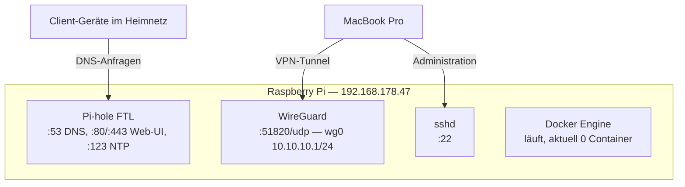

# Phase 0 — Doku-Grundlage

## Ziel

Bevor überwacht wird, muss dokumentiert sein, was überhaupt läuft. Zwei Ergebnisse: ein Netzwerkdiagramm (physisch + logisch) und ein Asset-Inventar der aktuellen Lab-Umgebung. Selbst schon Prüfungsstoff — Dokumentation ist eigenes Thema in Domain 3.

## Schritt 1: Bestandsaufnahme auf dem Pi

Per SSH ausgeführt (24.08.2026):

```bash
systemctl list-units --type=service --state=running
sudo ss -tulpn
docker ps
ip -br addr show
hostnamectl
```

## Schritt 2: Befund

**Host:** `RaspberryPi`, Debian GNU/Linux 13 (trixie), Kernel 6.18.29-rpt-rpi-v8, arm64

**Netzwerk-Interfaces:**

| Interface | Status | Adresse | Zweck |
|---|---|---|---|
| `eth0` | UP | 192.168.178.47/24 | Kabelverbindung, feste IP (Pi Network Lab Phase 1) |
| `wlan0` | DORMANT | — | bewusst deaktiviert (nur Kabel, Pi Network Lab Phase 1) |
| `wg0` | UP | 10.10.10.1/24 | WireGuard-VPN-Tunnel (Pi Network Lab Phase 3) |
| `docker0` | DOWN | 172.17.0.1/16 | Docker-Bridge, existiert aber aktuell ungenutzt (kein Container läuft) |

**Offene Ports:**

| Port | Protokoll | Dienst | Projekt |
|---|---|---|---|
| 22 | TCP | SSH | Basis-Zugriff |
| 53 | TCP/UDP | Pi-hole FTL (DNS) | Pi Network Lab |
| 80 | TCP | Pi-hole FTL (Web-UI) | Pi Network Lab |
| 443 | TCP | Pi-hole FTL (Web-UI, TLS) | Pi Network Lab |
| 123 | UDP | Pi-hole FTL (eingebauter NTP-Dienst, seit Pi-hole v6) | Pi Network Lab |
| 51820 | UDP | WireGuard | Pi Network Lab |
| 5353 | UDP | Avahi (mDNS) | Debian-Standard, nicht projektspezifisch |

**Wichtig für später (Phase 1 von [pi-docker-stack](https://github.com/dominiklochner/pi-docker-stack)):** Pi-hole belegt aktuell 80/443 auf allen Interfaces — genau der Port-Konflikt, der dort schon als "Konflikt-Vermeidung" dokumentiert ist. Noch nicht relevant, da dort noch kein Reverse Proxy läuft.

**Laufende Dienste (Auswahl, projektrelevant):** `pihole-FTL`, `NetworkManager`, `ssh`, `docker` + `containerd` (Engine läuft, aktuell aber **kein Container aktiv** — `docker ps` leer), `wpa_supplicant`, `avahi-daemon`.

## Schritt 3: Netzwerkdiagramm

**Physisch:**

```mermaid
graph LR
    Internet((Internet))
    FritzBox["FritzBox<br/>Router / Standard-Gateway"]
    Pi["Raspberry Pi<br/>192.168.178.47<br/>eth0, Kabel"]
    Mac["MacBook Pro M1<br/>DHCP, WLAN/Kabel"]

    Internet <--> FritzBox
    FritzBox <--> Pi
    FritzBox <--> Mac
    Mac -.WireGuard-Tunnel<br/>10.10.10.0/24.-> Pi
```

**Logisch (Dienste & Ports auf dem Pi):**



## Schritt 4: Asset-Inventar

| Gerät | IP(s) | Rolle | Projekt |
|---|---|---|---|
| Raspberry Pi (`RaspberryPi`) | 192.168.178.47 (eth0), 10.10.10.1 (wg0) | DNS-Server, VPN-Gateway, SSH-Host, Docker-Host (bereit) | Pi Network Lab, Pi Docker Stack, Pi Monitoring Lab |
| MacBook Pro (M1) | dynamisch (DHCP) | Steuerzentrale, SSH-Client, WireGuard-Peer | alle Projekte |
| FritzBox (Router) | 192.168.178.1 (Standard-Gateway, verifiziert) | Router, DHCP-Server, Port-Forwarding UDP 51820 → Pi | Pi Network Lab |

## Phase 0 — Status: abgeschlossen ✅

## Nächster Schritt

→ Phase 1: Packet Capture (`docs/01-packet-capture.md`, folgt)
